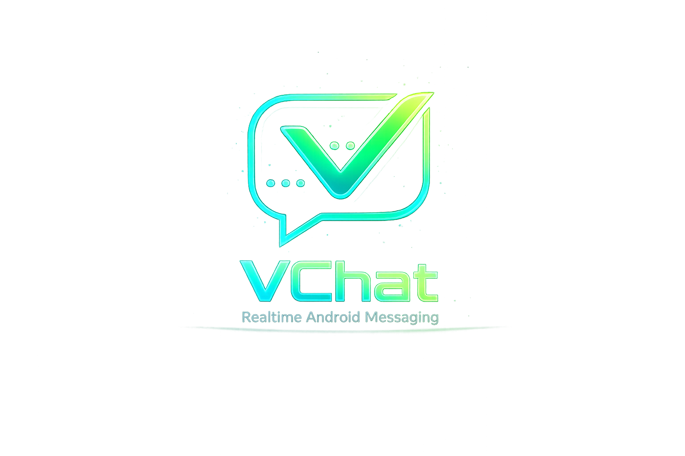
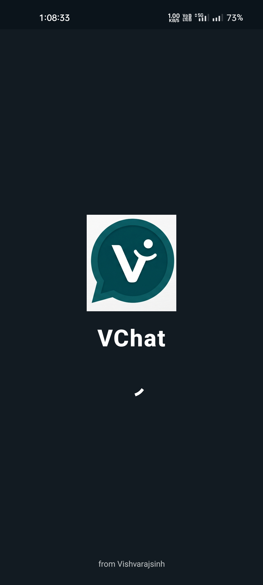
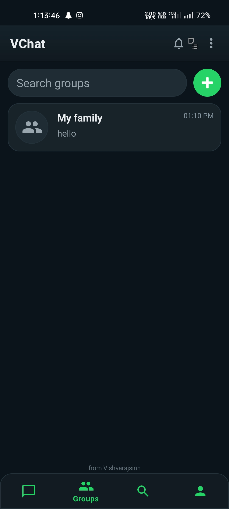
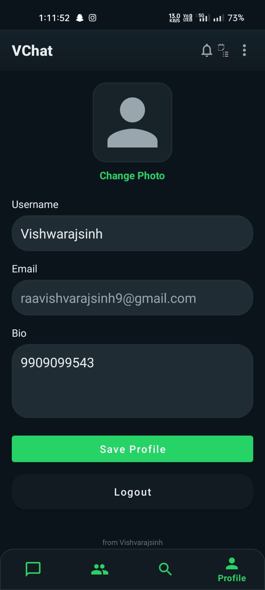

<div align="center">



# VChat Android

A comprehensive real-time messaging application built with Java, Android SDK, and Firebase. This is the native Android companion to the VChat Web application, offering a seamless and robust mobile communication experience.


</div>

---

## Download APK

**[Download Latest APK (v1.0.0)](https://github.com/Vlabs99/Vchat/releases/latest)** *(Check the GitHub Releases tab for the compiled APK)*

---

## Screenshots

| Splash | Chat List |
|---|---|
|  |  |

| Private Chat | Group Chat |
|---|---|
|  |  |

| Group Settings | Profile |
|---|---|
|  |  |

| User Search |
|---|
|  |

---

## Features

### Messaging System
- [x] Realtime messaging & Firestore synchronization
- [x] Direct one-to-one chats & Group chats
- [x] Reply to message & Forward message
- [x] Pinned messages & Message pagination
- [x] Typing indicators & Realtime message updates

### Group System
- [x] Group creation with add/remove member functionality
- [x] Group admin messaging control
- [x] Group system messages
- [x] Group resurrection after new messages
- [x] Group chat visibility restoration

### Relationship System
- [x] Send, accept, and reject friend requests
- [x] Remove friend & Block/Unblock user
- [x] Friend-only messaging restrictions
- [x] Pending request handling

### Lifecycle & Restriction System
- [x] Delete chat for me (Old hidden history isolation)
- [x] Fresh chat reopen lifecycle
- [x] Restriction banners & Composer visibility control

---

## Architecture

VChat follows a modular realtime architecture focused on scalability, lifecycle safety, and realtime synchronization.

### Core Systems
- Realtime Firestore listener system
- Modular manager/helper architecture
- Restriction precedence engine
- Lifecycle-safe chat restoration & Thread-safe UI updates
- Group resurrection flow

### Main Managers
- `ChatComposerController`
- `ReplyManager`, `ForwardManager`, `TypingManager`
- `FriendManager`, `GroupManager`, `ChatManager`

---

## Tech Stack

- **Java** & **Android Studio** (Material Design)
- **Firebase Authentication**
- **Cloud Firestore**
- **Firebase Cloud Storage**
- **Gradle** (Build System)

---

## Installation

1. Clone the repository:
   ```bash
   git clone https://github.com/Vlabs99/Vchat.git
   ```
2. Open the project in **Android Studio** (Hedgehog or newer).
3. Allow Gradle to sync the project dependencies.
4. Add your `google-services.json` file (obtained from your Firebase Console) to the `app/` directory.
5. Click **Run** (Shift + F10) to build and install the app on your emulator or connected physical device.

---

## Future Improvements

- [ ] End-to-End Encryption
- [ ] Push Notifications via FCM (Firebase Cloud Messaging)
- [ ] Voice and Video Calling Integration
- [ ] Advanced Message Formatting & Code Snippets

---

## Developer

**Vishwarajsinh Chudasama**
- GitHub: [@Vlabs99](https://github.com/Vlabs99)
- Portfolio: [Vlabs99.github.io/VLabs](https://Vlabs99.github.io/VLabs/)
- MCA Student • Android Developer • Realtime Systems Enthusiast
